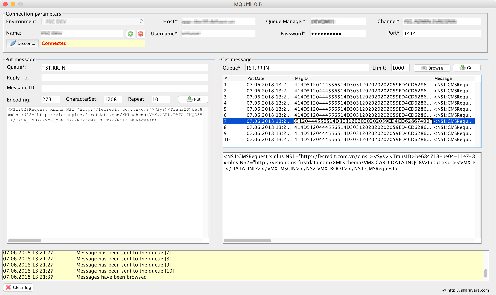
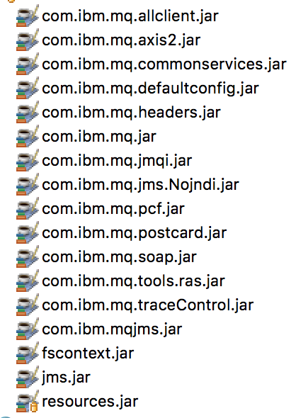

# MQ.Util

`The application is not finished. You are welcome to make it better!`

This is very simple application for messages manipulation in IBM MQ:

You have to add next libraries into the project:

